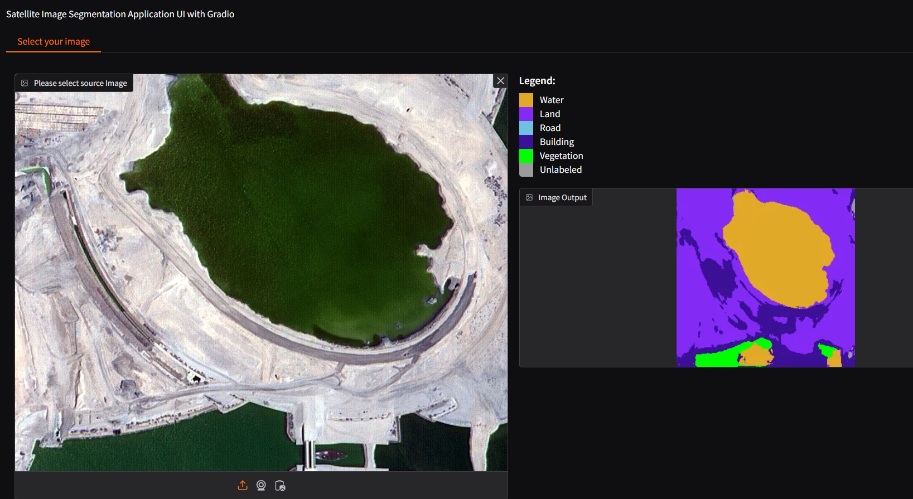

# Satellite Image Segmentation Application

Welcome to the **Satellite Image Segmentation Application**, an intuitive tool designed to harness the power of deep learning for precise land cover classification from satellite imagery. This application leverages state-of-the-art machine learning techniques to segment images into various classes, aiding in environmental monitoring, urban planning, and agricultural analysis.

## Table of Contents

- [Features](#features)
- [Technologies Used](#technologies-used)
- [Installation](#installation)
- [Usage](#usage)
- [How It Works](#how-it-works)

## Features

- **User-Friendly Interface**: Built with Gradio, the application provides an easy-to-use interface for uploading images and displaying results.
- **Real-Time Segmentation**: Process satellite images quickly and efficiently to generate segmented outputs in real time.
- **Color-Coded Segmentation**: Each class (water, land, road, building, vegetation, unlabeled) is represented by a distinct color for easy visualization and interpretation.
- **Interactive Legend**: A clear legend provides an overview of the segmentation classes and their corresponding colors.

## Technologies Used

- **Python**: The core programming language for model development and data manipulation.
- **TensorFlow/Keras**: For building and training the deep learning model.
- **Gradio**: To create an interactive web interface for the application.
- **NumPy**: For numerical operations and handling image data.
- **Pillow**: For image processing tasks.

## Installation

To run the application locally, follow these steps:

1. Clone the repository:
   ```bash
   git clone https://github.com/yourusername/satellite-image-segmentation.git
   cd satellite-image-segmentation
2. pip install -r requirements.txt
3. Load your pre-trained model into the code where specified
4. python app.py
Open your web browser and navigate to http://localhost:7860 to access the application.

## Usage
Upload a satellite image by clicking the "Please select source Image" button.
Click "Load above Image" to process the image.
View the segmented output displayed alongside the interactive legend.

## How It Works
The application uses a convolutional neural network (CNN) trained on a dataset of labeled satellite images. It processes the input image to predict pixel-wise labels based on learned patterns from the training data. The RGB representation of each class is applied to visualize the segmented areas effectively.

The segmentation classes include:

Water: Represented in yellow
Land: Represented in purple
Road: Represented in blue
Building: Represented in dark purple
Vegetation: Represented in green
Unlabeled: Represented in gray


